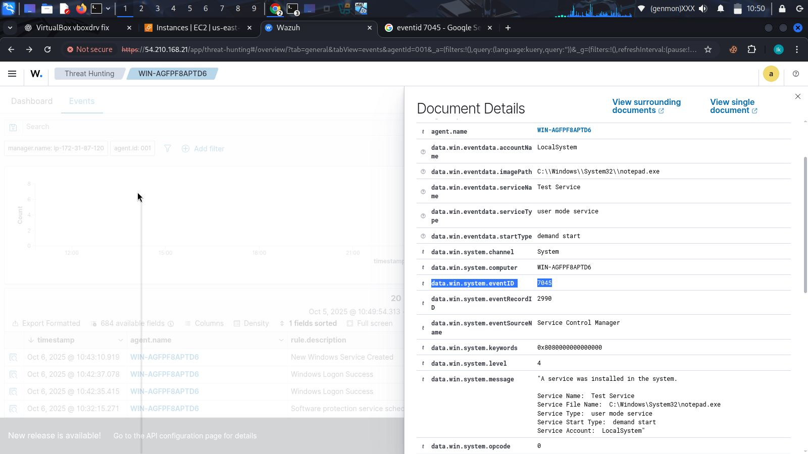

# 🛡️ Security Operations Center (SOC) Internship Journey

## 🔍 Overview: WELCOME TO MY SOC INTERNSHIP JOURNEY REPOSITORY!
This repository documents my hands-on learning experience during my **SOC Internship**, where I explored how to monitor, detect, and analyze threats using **Wazuh**, **Sysmon**, and **APTSimulator**.

---

## 🧩 Topics Covered

### 1️⃣ Introduction to SOC and Wazuh Installation
- Learned SOC fundamentals — roles, workflow, and components.
- Installed **Wazuh Manager**, **Dashboard**, and **Agent**.
- Understood how Wazuh collects, analyzes, and visualizes endpoint logs.

---

### 2️⃣ Windows Server Integration with Wazuh (Event 7045)
- Installed and configured **Windows Server**.
- Deployed the **Wazuh Agent** on Windows and connected it to the Wazuh Manager.
- Monitored **Event ID 7045** (service creation) to detect new or suspicious services.

---

### 3️⃣ Sysmon Configuration and Wazuh Integration
- Installed **Sysmon (System Monitor)** for detailed system telemetry.
- Applied a **custom Sysmon configuration** to log process creation, file changes, and DNS queries.
- Integrated Sysmon logs with Wazuh for enhanced visibility.

---

### 4️⃣ APT Simulation Testing
- Installed **APTSimulator** to simulate advanced persistent threat behaviors.
- Ran attack simulations to test Wazuh’s detection capabilities.
- Successfully observed Sysmon and Wazuh alerts for simulated threats.

## 📸 Screenshots from My SOC Internship Journey

### 🧠 1. Wazuh Manager Installation  
During this phase, I deployed the **Wazuh Manager** and set up the **Dashboard** for centralized log monitoring and analysis.  

---

### 💻 2. Ubuntu Server Setup  
Configured and secured my **Ubuntu server environment**, ensuring it could host Wazuh components efficiently.  

---

### ⚙️ 3. Sysmon Installation and Configuration  
Installed **Sysmon (System Monitor)** to collect advanced system telemetry such as process creation, network connections, and file modifications.  

---

### 🔗 4. Integrating Sysmon with Wazuh Dashboard  
Integrated Sysmon logs into Wazuh to visualize and correlate Windows endpoint activities in real-time.  

---

### 🪟 5. Windows Agent Deployment  
Deployed the **Wazuh Agent** on Windows Server and connected it to the Manager to begin log collection and monitoring.  

---

### 📄 6. Event Log Monitoring (Event 7045)  
Monitored **Event ID 7045** — a key Windows event used to detect the creation of new or suspicious services.  

---

### 🕵️ 7. Sysmon Process Monitoring on Windows  
Observed Sysmon capturing DNS queries, process executions, and network connections for deeper threat visibility.  

---

### 🧩 8. Editing Sysmon Configuration on OSSEC  
Modified and fine-tuned **Sysmon XML rules** via OSSEC configuration to improve detection precision.  

---

### 🔥 9. APT Simulator Testing  
Used **APTSimulator** to simulate advanced persistent threat behaviors and validate Wazuh’s detection capabilities.  

---

### 🚨 10. Wazuh Alert from APT Simulation  
Observed **Wazuh alerts** triggered by simulated attacks, confirming successful Sysmon + Wazuh correlation.  

## 🧠 Key Learnings
- Understood how SOCs detect and respond to cyber threats.  
- Learned endpoint monitoring using **Wazuh** and **Sysmon**.  
- Validated detections with real-world APT simulations.  
- Strengthened my **Blue Team** and **Incident Response** skills.

---

## 🛠️ Tools Used
- **Wazuh** – Open-source SIEM and XDR platform  
- **Sysmon** – Windows system monitoring tool  
- **APTSimulator** – Attack simulation framework  
- **Windows Server** – Target endpoint for integration and testing  

---

## 🧾 License
Licensed under the [MIT License](LICENSE).

---

**#CyberSecurity #SOC #Wazuh #Sysmon #APTSimulator #ThreatDetection #BlueTeam #HandsOnLearning**

